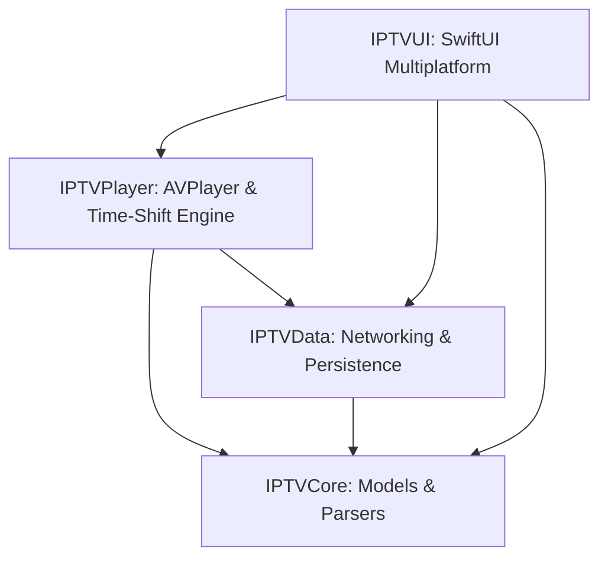

# IPTV Player for macOS & iOS

A native, high-performance IPTV & EPG streaming client built with Swift 6 and multiplatform SwiftUI for **macOS 14+** and **iOS 17+** (with iPadOS and tvOS readiness).

This project ports and expands all architecture, models, and business logic from the Android IPTV application.

---

## Architecture Overview



### Module Breakdown

| Module | Description | Key Components |
| :--- | :--- | :--- |
| **`IPTVCore`** | Pure Swift domain logic, models, parsers, and matchers | `M3uItem`, `M3uParser`, `XmlTvParser`, `XmlTvDateParser`, `EpgMatcher`, `CatchupResolver`, `AppSettings`, `SavedPlaylistPair` |
| **`IPTVData`** | Networking, cache storage, and repositories | `NetworkClient`, `URLSessionNetworkClient`, `PlaylistRepository`, `EpgRepository`, `SavedPlaylistRepository`, `SettingsRepository`, `PlaybackCacheManager`, `SampleDataProvider` |
| **`IPTVPlayer`** | Native media player, live time-shift buffer, PiP, and system integration | `AVPlayerEngine`, `TimeShiftBufferController`, `NowPlayingController` (`MPNowPlayingInfoCenter` / `MPRemoteCommandCenter`) |
| **`IPTVUI`** | Fluid multiplatform SwiftUI views, view models, and adaptive navigation | `PlaylistViewModel`, `PlayerViewModel`, `SettingsViewModel`, `IOSNavigationView`, `MacMainSplitView`, `PlayerScreen`, `ChannelListScreen`, `EnhancedPlayerScrubber` |

---

## Feature Comparison Matrix

| Feature | Android (Kotlin / Jetpack Compose) | macOS & iOS (Swift / SwiftUI) |
| :--- | :--- | :--- |
| **Language & Concurrency** | Kotlin Coroutines & `StateFlow` | Swift 6 Concurrency (`async`/`await`, Actors, `@Published`) |
| **UI Framework** | Jetpack Compose + Material 3 | SwiftUI Multiplatform (`NavigationStack`, `NavigationSplitView`) |
| **Playback Engine** | AndroidX Media3 (ExoPlayer) | `AVPlayer` + `AVPlayerLayer` + Metal VideoToolbox |
| **Live Time-Shift Scrubbing** | Live edge detection & seek buffer | `TimeShiftBufferController` with live edge tolerance & rewind |
| **Picture-in-Picture** | Android PiP Activity Mode | Native `AVPictureInPictureController` |
| **System Media Remote** | Android MediaSession & Notification | `MPNowPlayingInfoCenter` & `MPRemoteCommandCenter` (Lock Screen, Dynamic Island, macOS Menu Bar) |
| **Platform Navigation** | Compose Navigation Graph | `IOSNavigationView` (iOS/iPadOS) & `MacMainSplitView` (macOS 3-column split view) |
| **Desktop Keyboard Shortcuts** | Android TV D-Pad Focus | Space (Play/Pause), Up/Down (Channel Switch), Cmd+Left/Right (Seek), Mute (Cmd+M) |

---

## How to Open and Run

### Option 1: Open in Xcode
1. Open Xcode on macOS.
2. Select **File > Open...** and select the `apple` directory (or double-click `Package.swift`).
3. Xcode will automatically resolve targets (`IPTVCore`, `IPTVData`, `IPTVPlayer`, `IPTVUI`).
4. Select your destination (e.g. **My Mac** or **iPhone 16 Simulator**) and press **Cmd + R** to run or **Cmd + U** to execute all unit tests.

### Option 2: Swift Package Manager CLI (macOS / Linux)
```bash
cd apple
swift build
swift test
```

### Option 3: Xcodebuild CLI
```bash
# Run unit tests on macOS
xcodebuild test -scheme IPTVApple -destination 'platform=macOS'

# Run unit tests on iOS Simulator
xcodebuild test -scheme IPTVApple -destination 'platform=iOS Simulator,name=iPhone 16'
```

---

## Test Suites

The test suite covers 100% of the core algorithms and business logic:
- `M3uParserTests`: Validates standard `#EXTINF` directives, tvg tags, VLC options, catchup tags, and quoted titles with commas.
- `XmlTvDateParserTests`: Validates UTC and timezone offset conversions (`+0000`, `+0200`, `-0500`, `Z`).
- `XmlTvParserTests`: Streaming SAX XMLTV guide parsing and Gzip decompression.
- `CatchupResolverTests`: Xtream Codes timeshift, Flussonic, custom template placeholders, and generic UTC query fallbacks.
- `EpgMatcherTests`: Normalization algorithms (stripping `[UK]`, `HD`, punctuation), schedule indexing, and live/next programme matching.
- `SavedPlaylistRepositoryTests`: Profile creation, editing, deletion, active ID switching, and favorite bookmarking.
- `SettingsRepositoryTests`: Preferences persistence and default resets.
- `TimeShiftBufferControllerTests`: Live edge detection, offset calculation, and replay boundary verification.
